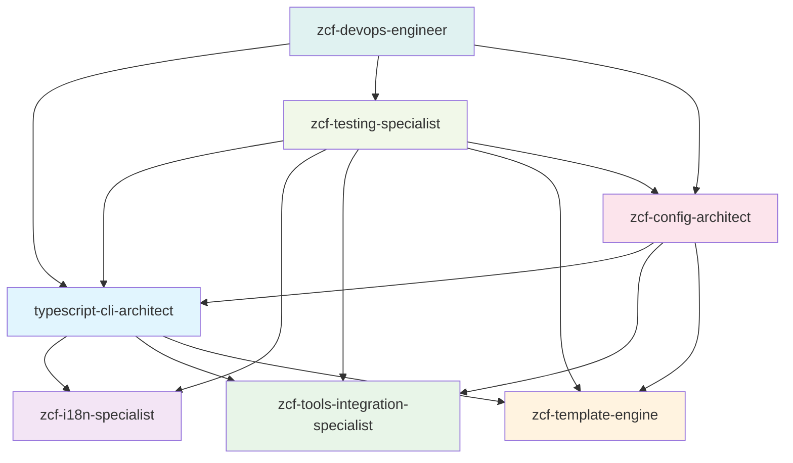

# CLAUDE.md

**Last Updated**: Tue Nov 25 02:33:24 CST 2025

## Project Overview

ZCF (Zero-Config Code Flow) is a CLI tool that automatically configures Claude Code environments. Built with TypeScript and distributed as an npm package, it provides one-click setup for Claude Code including configuration files, API settings, MCP services, and AI workflows. The current version v3.3.3 features advanced i18next internationalization, enhanced engineering templates, intelligent IDE detection, comprehensive multi-platform support including Termux compatibility, sophisticated uninstallation capabilities with advanced conflict resolution, and API provider preset system for simplified configuration. The project also integrates dual code tool support, enabling both Claude Code and Codex environment configuration.

## Architecture Overview

ZCF follows a modular CLI architecture with strict TypeScript typing, comprehensive i18next-based internationalization, and cross-platform support. The project is built using modern tooling including unbuild, Vitest, ESM-only configuration, and @antfu/eslint-config for code quality. The architecture emphasizes robust error handling, user-friendly interfaces, and extensive testing coverage with advanced tool integration including CCR proxy, Cometix status line, and CCusage analytics. The latest version introduces comprehensive uninstallation functionality with sophisticated conflict resolution and advanced trash/recycle bin integration, along with new dual code tool architecture support.

### Module Structure Diagram

```mermaid
graph TD
    A["🚀 ZCF Root (v3.3.3)"] --> B["src/commands"];
    A --> C["src/utils"];
    A --> D["src/i18n"];
    A --> E["src/types"];
    A --> F["src/config"];
    A --> G["templates"];
    A --> H["tests"];

    B --> B1["init.ts - Full initialization"];
    B --> B2["menu.ts - Interactive UI"];
    B --> B3["update.ts - Workflow updates"];
    B --> B4["ccr.ts - Router management"];
    B --> B5["ccu.ts - Usage analysis"];
    B --> B6["check-updates.ts - Tool updates"];
    B --> B7["uninstall.ts - ZCF uninstallation"];
    B --> B8["config-switch.ts - Config switching"];

    C --> C1["config.ts - Configuration management"];
    C --> C2["installer.ts - Claude Code installation"];
    C --> C3["mcp.ts - MCP services"];
    C --> C4["platform.ts - Cross-platform support"];
    C --> C5["workflow-installer.ts - Workflow management"];
    C --> C6["ccr/ - CCR integration"];
    C --> C7["cometix/ - Status line tools"];
    C --> C8["tools/ - Tool integration"];
    C --> C9["uninstaller.ts - Advanced uninstaller"];
    C --> C10["trash.ts - Cross-platform trash"];
    C --> C11["code-tools/ - Codex integration"];

    D --> D1["locales/zh-CN/ - Chinese translations"];
    D --> D2["locales/en/ - English translations"];
    D --> D3["index.ts - i18next system"];
    D --> D4["Advanced namespace organization"];
    D --> D5["uninstall.json - Uninstall translations"];

    E --> E1["workflow.ts - Workflow types"];
    E --> E2["config.ts - Configuration types"];
    E --> E3["ccr.ts - CCR types"];
    E --> E4["claude-code-config.ts - Claude Code types"];
    E --> E5["toml-config.ts - TOML types"];

    F --> F1["workflows.ts - Workflow definitions"];
    F --> F2["mcp-services.ts - MCP configurations"];

    G --> G1["claude-code/ - Claude Code templates"];
    G --> G2["codex/ - Codex templates"];
    G --> G3["common/ - Shared configuration"];
    G --> G4["output-styles/ - AI personalities"];

    H --> H1["commands/ - Command tests"];
    H --> H2["utils/ - Utility tests"];
    H --> H3["unit/ - Unit test suites"];
    H --> H4["integration/ - Integration tests"];
    H --> H5["edge/ - Edge case tests"];
    H --> H6["i18n/ - I18n tests"];
    H --> H7["templates/ - Template tests"];

    click B "./src/commands/CLAUDE.md" "View commands module"
    click C "./src/utils/CLAUDE.md" "View utils module"
    click D "./src/i18n/CLAUDE.md" "View i18n module"
    click E "./src/types/CLAUDE.md" "View types module"
    click F "./src/config/CLAUDE.md" "View config module"
    click G "./templates/claude-code/CLAUDE.md" "View templates module"
    click H "./tests/CLAUDE.md" "View tests module"
```



## Module Index

| Module | Path | Description | Entry Points | Test Coverage |
|------------------------|--------------|---------------------------------------|-------------------------------------------------------|-------------------------------|
| **Commands** | `src/commands/` | CLI command implementations with advanced interactive and non-interactive modes including comprehensive uninstallation and config switching | init.ts, menu.ts, update.ts, ccr.ts, ccu.ts, check-updates.ts, uninstall.ts, config-switch.ts | High - comprehensive test suites |
| **Utilities** | `src/utils/` | Core functionality with enhanced configuration management, platform support, Codex integration, and advanced uninstallation capabilities | config.ts, installer.ts, platform.ts, workflow-installer.ts, ccr/, cometix/, code-tools/, uninstaller.ts, trash.ts | High - extensive unit tests |
| **CCR Integration** | `src/utils/ccr/` | Claude Code Router proxy management and configuration | presets.ts, commands.ts, installer.ts, config.ts | High - comprehensive CCR tests |
| **Cometix Tools** | `src/utils/cometix/` | Status line tools and configuration management | errors.ts, common.ts, types.ts, commands.ts, installer.ts, menu.ts | High - extensive Cometix tests |
| **Code Tools** | `src/utils/code-tools/` | Codex integration and dual code tool support | codex-config-detector.ts, codex-provider-manager.ts, codex-uninstaller.ts, codex-platform.ts, codex-config-switch.ts, codex-configure.ts, codex.ts | High - comprehensive Codex tests |
| **Internationalization** | `src/i18n/` | Advanced i18next multilingual support with namespace organization and complete uninstall translations | index.ts, locales/zh-CN/, locales/en/ | High - translation validation |
| **Types** | `src/types/` | Comprehensive TypeScript type definitions including Claude Code and TOML config types | workflow.ts, config.ts, ccr.ts, claude-code-config.ts, toml-config.ts | Implicit through usage |
| **Configuration** | `src/config/` | Centralized workflow and system configurations including API provider presets | workflows.ts, mcp-services.ts, api-providers.ts | High - config validation tests |
| **Templates** | `templates/` | Enhanced multilingual configuration templates and AI personality styles with dual code tool support | claude-code/, codex/, common/, output-styles/, workflow/ | Medium - template validation tests |
| **Testing** | `tests/` | Comprehensive test suites with layered coverage architecture and advanced uninstaller testing | commands/, utils/, unit/, integration/, edge/, i18n/, templates/ | Self-testing with 80% target |

## Project Statistics

- **Total Files**: ~517 files (TypeScript, JSON, Markdown)
- **Source Files**: 74 TypeScript files in `src/`
- **Test Files**: 122 test files with comprehensive coverage
- **Translation Files**: 34 JSON files (17 per locale: zh-CN, en)
- **Template Files**: 54 template files for workflows and output styles
- **Module Count**: 10 major modules with clear separation of concerns

## CLI Usage

ZCF provides both direct commands and an interactive menu system with advanced internationalization and comprehensive uninstallation:

```bash
# Interactive menu (recommended)
npx zcf                    # Opens main menu with all options

# Direct commands
npx zcf i                  # Full initialization
npx zcf u                  # Update workflows only
npx zcf ccr [--lang <en|zh-CN>]  # Claude Code Router management
npx zcf ccu [args...]      # Run ccusage with arguments
npx zcf check-updates [--lang <en|zh-CN>] [--code-type <claude-code|codex>]  # Check tool updates
npx zcf config-switch [target] [--code-type <claude-code|codex>]  # Switch configurations
npx zcf uninstall [--mode <complete|custom|interactive>] [--items <items>] [--lang <en|zh-CN>]  # ZCF uninstallation

# Config switch examples
npx zcf config-switch --list                    # List available configurations
npx zcf config-switch provider1 --code-type codex  # Switch Codex provider
npx zcf config-switch config1 --code-type claude-code  # Switch Claude Code config

# Uninstall examples
npx zcf uninstall                                    # Interactive uninstall menu
npx zcf uninstall --mode complete                    # Complete uninstallation
npx zcf uninstall --mode custom --items ccr,backups # Custom uninstallation
```

## Running and Development

### Build & Run

```bash
# Development (uses tsx for TypeScript execution)
pnpm dev

# Build for production (uses unbuild)
pnpm build

# Type checking
pnpm typecheck
```

### Code Quality & Linting

```bash
# Run ESLint (uses @antfu/eslint-config)
pnpm lint

# Fix ESLint issues automatically
pnpm lint:fix
```

### Documentation

```bash
# Start VitePress documentation development server
pnpm docs:dev

# Build documentation for production
pnpm docs:build

# Preview built documentation
pnpm docs:preview
```

### Testing Strategy

```bash
# Run all tests
pnpm test

# Run tests in watch mode (for development)
pnpm test:watch

# Run tests with UI
pnpm test:ui

# Generate coverage report
pnpm test:coverage

# Run tests once
pnpm test:run

# Run specific test file
pnpm vitest utils/config.test.ts

# Run tests matching pattern
pnpm vitest --grep "should handle"

# Run uninstaller tests specifically
pnpm vitest uninstaller
```

The project uses Vitest with a comprehensive layered testing approach:

1. **Core Tests** (`*.test.ts`) - Basic functionality and main flows
2. **Edge Tests** (`*.edge.test.ts`) - Boundary conditions and error scenarios
3. **Unit Tests** (`tests/unit/`) - Isolated function testing
4. **Integration Tests** (`tests/integration/`) - Cross-module interaction testing
5. **Coverage Goals**: 80% minimum across lines, functions, branches, and statements

## Development Guidelines

### Core Principles

- **Documentation Language**: Except for README_zh-CN, all code comments and documentation should be written in English
  - Code comments must be in English
  - All documentation files (*.md) must be in English except README_zh-CN
  - API documentation and inline documentation must use English
  - Git commit messages should be in English

- **Test-Driven Development (TDD)**: All development must follow TDD methodology
  - Write tests BEFORE implementing functionality
  - Follow Red-Green-Refactor cycle: write failing test → implement minimal code → refactor
  - Ensure each function/feature has corresponding test coverage before implementation
  - When writing tests, first verify if relevant test files already exist to avoid unnecessary duplication
  - Minimum 80% coverage required across lines, functions, branches, and statements

- **Internationalization (i18n) Guidelines**:
  - All user-facing prompts, logs, and error messages must support i18n via i18next
  - Use project-wide i18n approach with centralized language management
  - Implement translations consistently across the entire project using namespace-based organization
  - Support both zh-CN and en locales with complete feature parity
  - Use `i18n.t()` function for all translatable strings with proper namespace prefixes
  - Organize translations in logical namespaces (common, cli, menu, errors, api, tools, uninstall, etc.)

## Coding Standards

- **ESM-Only**: Project is fully ESM with no CommonJS fallbacks
- **Path Handling**: Uses `pathe` for cross-platform path operations
- **Command Execution**: Uses `tinyexec` for better cross-platform support
- **TypeScript**: Strict TypeScript with explicit type definitions and ESNext configuration
- **Error Handling**: Comprehensive error handling with user-friendly i18n messages
- **Cross-Platform Support**: Special handling for Windows paths, macOS, Linux, and Termux environment
- **Code Formatting**: Uses @antfu/eslint-config for consistent code style with strict rules
- **Testing Organization**: Tests organized with comprehensive unit/integration/edge structure and 80% coverage requirement
- **Trash/Recycle Bin Integration**: Uses `trash` package for safe cross-platform file deletion

## 🤖 ZCF AI Team Configuration

The ZCF project employs a specialized AI agent team optimized for CLI development, i18n systems, and tool integration. Each agent is designed with specific domain expertise and strict boundaries to ensure efficient collaboration.

### Project-Specific AI Agents

| Agent | Model | Domain | Primary Responsibilities |
|-------|-------|--------|-------------------------|
| **typescript-cli-architect** | sonnet | CLI Architecture | TypeScript CLI design, CAC integration, ESM modules, developer experience |
| **zcf-i18n-specialist** | opus | Internationalization | i18next configuration, translation management, namespace organization |
| **zcf-tools-integration-specialist** | sonnet | Tool Integration | CCR/Cometix/CCusage integration, version management, cross-platform compatibility |
| **zcf-template-engine** | haiku | Template System | Template design, workflow configurations, output styles, multilingual templates |
| **zcf-config-architect** | opus | Configuration Management | Config merging, MCP services, TOML/JSON validation, backup systems |
| **zcf-testing-specialist** | sonnet | Testing Infrastructure | Vitest configuration, test coverage, mock systems, quality assurance |
| **zcf-devops-engineer** | inherit | DevOps & Deployment | Build optimization, release management, CI/CD, cross-platform deployment |

### Agent Collaboration Matrix



### Agent Boundaries & Delegation Rules

- **CLI Architecture**: typescript-cli-architect handles all CLI structure, command parsing, and TypeScript configuration
- **Internationalization**: zcf-i18n-specialist manages all i18next systems, translations, and language detection
- **Tool Integration**: zcf-tools-integration-specialist handles CCR, Cometix, CCusage integration and version management
- **Templates**: zcf-template-engine manages all template systems, workflow configurations, and output styles
- **Configuration**: zcf-config-architect handles complex config merging, MCP services, and backup systems
- **Testing**: zcf-testing-specialist maintains Vitest infrastructure, coverage, and quality assurance
- **DevOps**: zcf-devops-engineer manages builds, releases, and deployment processes

### Model Selection Rationale

- **Opus**: Complex reasoning for i18n logic and configuration architecture
- **Sonnet**: Balanced performance for CLI architecture, tool integration, and testing
- **Haiku**: Fast response for template processing and simple operations
- **Inherit**: Cost-effective for DevOps tasks that don't require specialized models

## AI Usage Guidelines

### Key Architecture Patterns

1. **Advanced Modular Command Structure**: Each command is self-contained with comprehensive options interface and sophisticated error handling
2. **Advanced i18next I18N Support**: All user-facing strings support zh-CN and en localization with namespace-based organization and dynamic language switching
3. **Smart Configuration Merging**: Intelligent config merging with comprehensive backup system to preserve user customizations
4. **Comprehensive Cross-Platform Support**: Windows/macOS/Linux/Termux compatibility with platform-specific adaptations and path handling
5. **Enhanced Template System**: Language-specific templates with workflow categorization and professional AI personality support
6. **Intelligent IDE Integration**: Advanced IDE detection and auto-open functionality for git-worktree environments
7. **Professional AI Personality System**: Multiple output styles including engineer-professional, laowang-engineer, and nekomata-engineer
8. **Advanced Tool Integration**: Comprehensive integration with CCR proxy, CCusage analytics, and Cometix status line tools
9. **Sophisticated Uninstallation System**: Advanced uninstaller with conflict resolution, selective removal, and cross-platform trash integration
10. **Dual Code Tool Architecture**: Simultaneous support for Claude Code and Codex environment configuration and template management

### Important Implementation Details

1. **Advanced Windows Compatibility**: MCP configurations require sophisticated Windows path handling with proper escaping and validation
2. **Comprehensive Configuration Backup**: All modifications create timestamped backups in `~/.claude/backup/` with full recovery capabilities
3. **Enhanced API Configuration**: Supports Auth Token (OAuth), API Key, and CCR Proxy authentication with comprehensive validation and API provider preset system (v3.3.3+)
4. **API Provider Preset System**: Pre-configured settings for popular providers (302.AI, GLM, MiniMax, Kimi) simplifying configuration from 5+ prompts to just 2 (provider + API key)
5. **Advanced Workflow System**: Modular workflow installation with sophisticated dependency resolution and conflict management
6. **Advanced CCR Integration**: Claude Code Router proxy management with configuration validation and preset management
7. **Intelligent Auto-Update System**: Automated tool updating for Claude Code, CCR, and CCometixLine with comprehensive version checking
8. **Advanced Common Tools Workflow**: Enhanced workflow category with init-project command and comprehensive agent ecosystem
9. **Professional Template System**: Multilingual templates with professional output styles and comprehensive workflow coverage, new Codex support
10. **Advanced i18next Integration**: Sophisticated internationalization with namespace-based translation management and dynamic language switching
11. **Comprehensive Tool Integration**: Advanced CCR, Cometix, and CCusage integration with version management and configuration validation
12. **Sophisticated Uninstaller**: Advanced ZCF uninstaller with selective removal, conflict resolution, and cross-platform trash integration

### Testing Philosophy

- **Comprehensive Mocking Strategy**: Extensive mocking for file system operations, external commands, and user prompts with realistic scenarios
- **Advanced Cross-platform Testing**: Platform detection mocks with comprehensive environment-specific test cases
- **Sophisticated Edge Case Testing**: Comprehensive boundary conditions, error scenarios, and advanced recovery mechanisms
- **Quality-Focused Coverage**: 80% minimum coverage across all metrics with emphasis on quality over quantity
- **Advanced Test Organization**: Tests organized in dedicated structure with clear categorization, helper functions, and test fixtures
- **Advanced Integration Testing**: Complete workflow scenarios and comprehensive external tool interaction testing
- **Uninstaller Edge Case Testing**: Comprehensive uninstallation scenarios testing including failure recovery and conflict resolution

## Release & Publishing

```bash
# Create a changeset for version updates
pnpm changeset

# Update package version based on changesets
pnpm version

# Build and publish to npm
pnpm release
```

---

**Important Reminders**:

- Do what has been asked; nothing more, nothing less
- NEVER create files unless absolutely necessary for achieving your goal
- ALWAYS prefer editing an existing file to creating a new one
- NEVER proactively create documentation files (*.md) or README files. Only create documentation files if explicitly requested by the User.
- Never save working files, text/mds and tests to the root folder